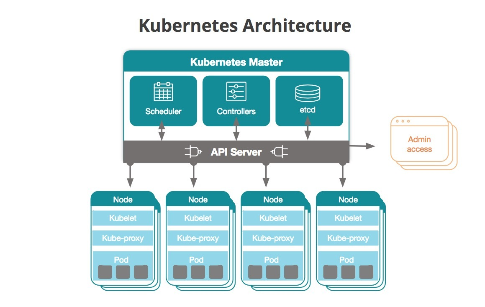
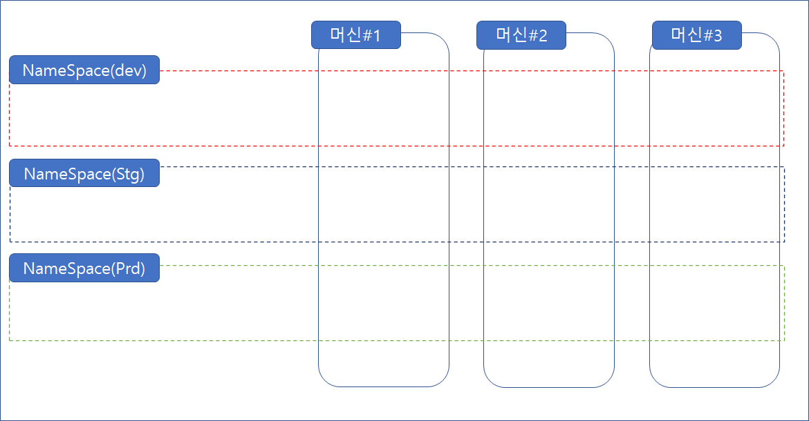

# 쿠버네티스 클러스터 구조

- 

- 클러스터 내에 복수의 노드가 존재하고 Worker Node들을 관리하는 Master Node가 존재한다.

- Node 내에는 복수의 Pod가 존재하고 Pod 내에는 복수의 컨테이너가 존재한다.

- 하나 혹은 복수의 Pod를 하나의 Service로 엮어 외부에서 접근할 수 있도록 한다.

- 

- 프로덕트의 크기가 클수록 Node, Pod, Service의 수는 늘어나고 관리에 어려움이 있다.

- 그렇기 때문에 이것을 연관성을 기준으로 논리적 구분을 Namespace를 통해 할 수 있다.

- Namespace의 역할은 논리적 구분과 해당 Namespace의 자원의 양을 한정하는 것이 있다.
