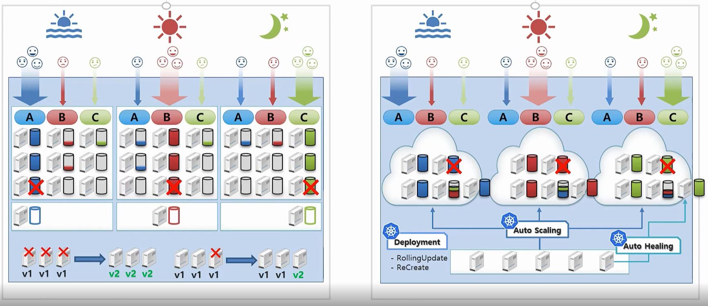

# 쿠버네티스의 장점

- 여러 서비스를 제공하는 경우 기존 인프라 환경에서는 서비스마다 각자의 서버 자원을 가지고 있고 사용량이 적더라도 사용량이 가장 많을 때에 맞춰 자원을 유지합니다.

- 쿠버네티스를 사용하면 Auto Scailing 기능으로 서비스마다 자원을 독립적으로 사용하지 않고 전체 서비스의 자원 중 각 서비스들에게 현재 사용량 만큼의 서버 자원을 할당해서 더 적은 서버 자원으로 서비스를 유지할 수 있습니다.

- 그리고 기존의 인프라 환경에선 백업 서버를 서비스마다 각각 준비해두고 한 서비스의 서버 컴퓨터가 다운되었을 경우 그 서비스만의 백업 서버 컴퓨터를 사용했습니다.

- 쿠버네티스의 Auto Healing 기능은 한 서비스의 서버 컴퓨터가 다운되었을 때 그 서비스의 서버를 다른 서버 컴퓨터로 자동으로 옮겨서 서비스에 장애가 생기는 것을 방지해줍니다.

- 기존 인프라 환경에서 서비스의 버전 업데이트가 필요한 경우 해당 서비스를 중단한 다음 업데이트를 진행하거나 3개의 서버 컴퓨터를 사용중이라면 하나씩 중단시킨후 업데이트해서 배포하는 방식이 필요했습니다.

- 쿠버네티스는 Deployment라는 객체를 통해 업데이트를 별도의 서버 중단 없이 자동화 기능을 지원합니다.

- 
